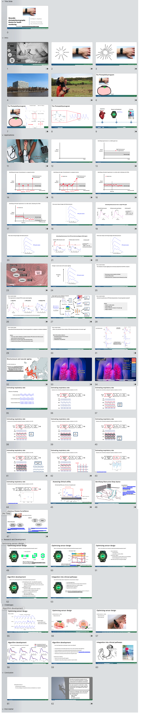

# Internal Presentations
{: .no_toc }

## Table of contents
{: .no_toc .text-delta }

1. TOC
{:toc}

---

## Photoplethysmography

---

### Photoplethysmography in a minute 

[Download powerpoint](https://zenodo.org/record/6193071/files/PPG%20in%20a%20minute.pptx?download=1){: .btn .btn-blue }
[Further details](https://peterhcharlton.github.io/talk/photoplethysmography-in-a-minute-and-a-bit/){: .btn .btn-purple }
[CC BY 4.0](https://creativecommons.org/licenses/by/4.0/){: .btn .btn-green }

---

### Opportunities for Photoplethysmography in Public Health

[Download powerpoint](https://zenodo.org/record/6352972/files/2022_opportunities_PPG.pptx?download=1){: .btn .btn-blue }
[Further details](https://peterhcharlton.github.io/talk/opportunities-for-photoplethysmography-in-public-health/){: .btn .btn-purple }
[CC BY 4.0](https://creativecommons.org/licenses/by/4.0/){: .btn .btn-green }

---

## Respiratory rate

---

### Developing software to monitor respiratory rate using wearable sensors

[Download powerpoint](https://zenodo.org/record/6424964/files/2022_Developing_RR_software.pptx?download=1){: .btn .btn-blue }
[Further details](https://peterhcharlton.github.io/talk/developing-software-to-monitor-respiratory-rate-using-wearable-sensors/){: .btn .btn-purple }
[CC BY 4.0](https://creativecommons.org/licenses/by/4.0/){: .btn .btn-green }

---

### The 'Respiratory rate algorithms for wearables' project 

[Download powerpoint](https://zenodo.org/record/4758898/files/RR%20algorithms%20for%20wearables%20intro.pptx?download=1){: .btn .btn-blue }
[Further details](https://peterhcharlton.github.io/talk/the-respiratory-rate-algorithms-for-wearables-project/){: .btn .btn-purple }
[CC BY 4.0](https://creativecommons.org/licenses/by/4.0/){: .btn .btn-green }

---

### Martin Black Prize presentation

[Download powerpoint](https://zenodo.org/record/6412387/files/Martin%20Black%20presentation%20FINAL%20%28public%29.pptx?download=1){: .btn .btn-blue }
[Further details](https://doi.org/10.5281/zenodo.891178){: .btn .btn-purple }
[CC BY 4.0](https://creativecommons.org/licenses/by/4.0/){: .btn .btn-green }

---

### Estimating respiratory rate from the electrocardiogram and photoplethysmogram

[Download powerpoint](https://zenodo.org/record/6402411/files/20180116%20RR%20Webinar.pptx?download=1){: .btn .btn-blue }
[Further details](https://doi.org/10.5281/zenodo.1148998){: .btn .btn-purple }
[CC BY 4.0](https://creativecommons.org/licenses/by/4.0/){: .btn .btn-green }

---

### Extraction of respiratory signals from the electrocardiogram and photoplethysmogram: technical and physiological determinants

[Download powerpoint](https://zenodo.org/record/6402475/files/20170316%20Respiratory%20signals.ppt?download=1){: .btn .btn-blue }
[Further details](https://doi.org/10.5281/zenodo.791798){: .btn .btn-purple }
[CC BY 4.0](https://creativecommons.org/licenses/by/4.0/){: .btn .btn-green }

---

### An assessment of algorithms to estimate respiratory rate from the electrocardiogram and photoplethysmogram

[Download powerpoint](https://zenodo.org/record/6402455/files/20160511%20Assessment%20of%20algorithms.ppt?download=1){: .btn .btn-blue }
[Further details](https://doi.org/10.5281/zenodo.662805){: .btn .btn-purple }
[CC BY 4.0](https://creativecommons.org/licenses/by/4.0/){: .btn .btn-green }

---

## Wearables

---

### Multimodal signal processing and learning for wearables

[Download powerpoint](https://zenodo.org/record/7734871/files/multimodal_sig_proc_2023.pptx?download=1){: .btn .btn-blue }
[Further details](https://peterhcharlton.github.io/talk/multimodal-signal-processing-and-learning-for-wearables/){: .btn .btn-purple }
[CC BY 4.0](https://creativecommons.org/licenses/by/4.0/){: .btn .btn-green }

---

### Wearable devices for health monitoring 

[Download powerpoint](https://zenodo.org/record/7301839/files/wearable_devices_health_monitoring_2022.pptx?download=1){: .btn .btn-blue }
[Further details](https://peterhcharlton.github.io/talk/wearable-devices-for-health-monitoring/){: .btn .btn-purple }
[CC BY 4.0](https://creativecommons.org/licenses/by/4.0/){: .btn .btn-green }

---

### Wearable photoplethysmography devices for cardiovascular monitoring 

[Download powerpoint](https://zenodo.org/record/6826343/files/wearable_ppg_embc_2022.pptx?download=1){: .btn .btn-blue }
[Further details](https://peterhcharlton.github.io/talk/wearable-photoplethysmography-devices-for-cardiovascular-monitoring/){: .btn .btn-purple }
[CC BY 4.0](https://creativecommons.org/licenses/by/4.0/){: .btn .btn-green }

---

### Realising the potential of wearables for health monitoring 

[Download powerpoint](https://zenodo.org/record/4616718/files/20200318_Realising_potential_wearables_red.pptx?download=1){: .btn .btn-blue }
[Further details](https://peterhcharlton.github.io/talk/realising-the-potential-of-wearables-for-health-monitoring/){: .btn .btn-purple }
[CC BY SA 4.0](https://creativecommons.org/licenses/by-sa/4.0/){: .btn .btn-green }

---

### Capitalising on Smart Wearables to Improve Health Monitoring

[Download powerpoint](https://zenodo.org/record/6402382/files/20180827%20PCharlton%20-%20Capitalising%20on%20Smart%20Wearables%20%28public%29.pptx?download=1){: .btn .btn-blue }
[Further details](https://doi.org/10.5281/zenodo.1406010){: .btn .btn-purple }
[CC BY 4.0](https://creativecommons.org/licenses/by/4.0/){: .btn .btn-green }

---

## Cardiovascular Modeling

---

### A database for developing pulse wave analysis algorithms 

[Download powerpoint](https://zenodo.org/record/6402305/files/20180907%20Pulse%20Wave%20Database%20%28Public%29.pptx?download=1){: .btn .btn-blue }
[Further details](https://peterhcharlton.github.io/talk/a-database-for-developing-pulse-wave-analysis-algorithms/){: .btn .btn-purple }
[CC BY 4.0](https://creativecommons.org/licenses/by/4.0/){: .btn .btn-green }

